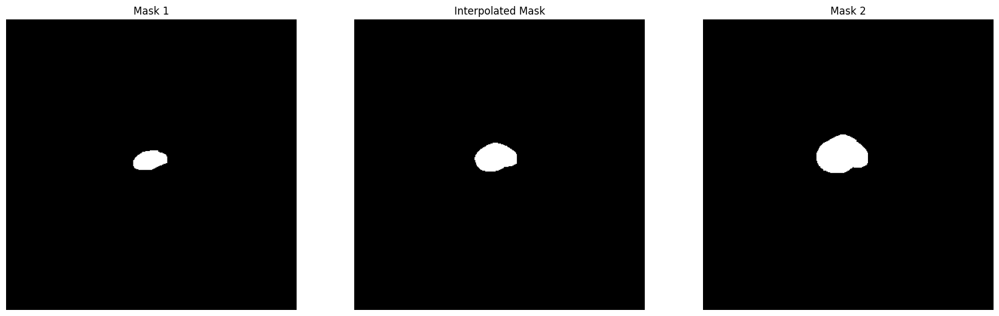
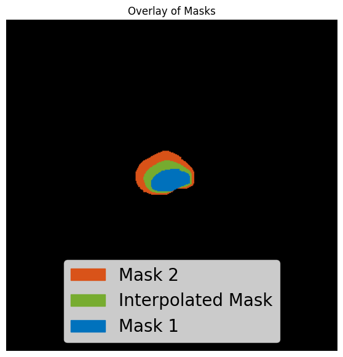

# **Binary Mask Interpolation for Semantic Segmentation with CNNs**

## **Overview**
In 3D medical image segmentation, CNNs often process slices independently, sometimes classifying non-adjacent slices as tumorous while leaving gaps (one or more slices) that are likely false negatives.
`binaryMaskInterpolation` notebook provides a post-processing method to interpolate missing slices based on adjacent or neighboring masks, improving segmentation continuity and reducing false negatives. It was used in [this project](https://github.com/innavoig23/Automatic-Prostate-Cancer-Segmentation-with-CNN-Deep-Learning).

## **Usage**
1. Load two 2D binary masks from images (PNGs, JPEGs, etc.).
2. Apply the `interp_mask` function to generate an interpolated mask.
3. Evaluate the interpolated mask visually to verify its accuracy.

The `interp_mask` function can be easily integrated into your own segmentation pipeline, adapting it properly.

## **Example Plots**
Below are sample outputs from the provided notebook.
In this example, the CNN identified two tumoral slices but left an intermediate slice as non-tumoral. However, when compared to the ground truth, this intermediate slice was actually tumoral (a false negative). This post-processing method helps restore continuity in such cases.

    <h3>#1</h3>
    

    <h3>#2</h3>
    

